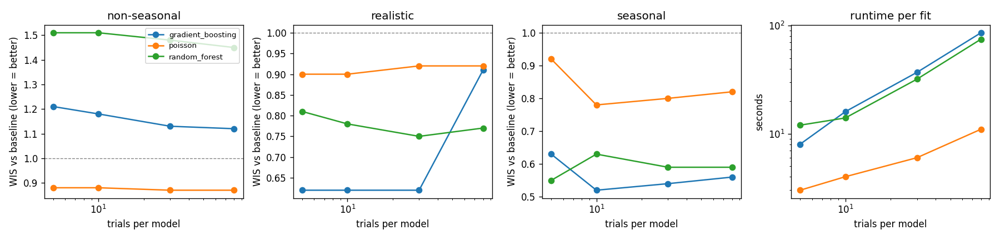

# Tuning & optimisation trials

!!! warning "Under testing"
    These results come from the synthetic benchmark (see [Benchmarks & synthetic data](benchmarks.md)), not from
    real surveillance data. Re-check on your own data using the backtests in the report.

**Short answer:** more trials are **not** reliably more accurate. On our benchmark, accuracy stopped improving
at about 10–30 trials per model (v2) or about 20 trials (v1), and more trials were sometimes *worse*,
while runtime grew in proportion to the number of trials.

| If you want… | v2 page: Model tuning | v1 page: Optimization Preset |
|---|---|---|
| A quick first look | Fast (10) | Fast (50) |
| A normal run | **Balanced (30), default** | Fast (50) is usually enough |
| To be thorough | Balanced (30); Deep (80) rarely helps | Balanced (200) only if you have time; Deep (500) can take many hours |

---

## Why more trials can make things worse

Tuning tries different model settings and keeps the ones with the smallest error on held-back parts of the
**training** data. With many trials, some settings do well on those particular held-back months by chance
("over-tuning"), and forecasts of genuinely new months get no better, or worse. ClimAID guards against the worst
case by keeping the default settings when tuning does not beat them, but it cannot tell chance from real
improvement within one training period.

---

## v2 results

12-month forecasts on three synthetic datasets from the start dates shared by every trial level (forecast years
2018 and 2022), 3 time-ordered tuning folds. The score is the probabilistic error (WIS) **relative to the
"same as recent years" baseline**; below 1.0 is better than the baseline.

| Dataset | Model | 5 trials | 10 | 30 | 80 |
|---|---|---|---|---|---|
| Seasonal | Gradient boosting | 0.63 | **0.52** | 0.54 | 0.56 |
| Seasonal | Poisson | 0.92 | **0.78** | 0.80 | 0.82 |
| Seasonal | Random forest | **0.55** | 0.63 | 0.59 | 0.59 |
| Realistic | Gradient boosting | 0.62 | 0.62 | 0.62 | 0.91 |
| Realistic | Poisson | **0.90** | **0.90** | 0.92 | 0.92 |
| Realistic | Random forest | 0.81 | 0.78 | **0.75** | 0.77 |
| Non-seasonal | Gradient boosting | 1.21 | 1.18 | 1.13 | **1.12** |
| Non-seasonal | Poisson | 0.88 | 0.88 | **0.87** | **0.87** |
| Non-seasonal | Random forest | 1.51 | 1.51 | 1.48 | **1.45** |

**Runtime per model fit** (one CPU core): gradient boosting 8 / 16 / 37 / 86 s, random forest 12 / 14 / 32 / 75 s,
Poisson 3 / 4 / 6 / 11 s for 5 / 10 / 30 / 80 trials. Backtests repeat this at every start date.



**What this shows**

* Going from 5 to 10 trials sometimes helped (seasonal gradient boosting 0.63 → 0.52, Poisson 0.92 → 0.78).
* Beyond 10–30 trials, results were flat or worse: realistic gradient boosting went from 0.62 to 0.91 at 80 trials.
* **The choice of model matters far more than the number of trials:** random forest stayed worse than the
  baseline on the non-seasonal data at every trial count.

---

## v1 results

ClimAID v1 (XGBoost base, random-forest residual, isotonic correction, as in v1 Fast and Balanced), forecasting
2020 from data up to 2019. To finish on one CPU core the lag grid was reduced (temperature and rainfall lags 0–2,
humidity 0–1, ENSO 0–3, top 10 configurations); the grid was fixed, so only the number of trials changed.

| Dataset | 5 trials | 20 trials | 50 trials |
|---|---|---|---|
| Seasonal (RMSE) | 11.6 | **10.2** | 11.0 |
| Realistic (RMSE) | 34.9 | **25.3** | 27.5 |
| Runtime | ~55 s | ~155 s | ~350 s |

* Going from 5 to 20 trials clearly helped; 50 trials were slightly worse than 20.
* Runtime grew by about 6.5 s per trial. **Extrapolated, not measured:** on this reduced grid, Balanced (200)
  would take about 20 minutes and Deep (500) about an hour per fit; on v1's full lag grid (ENSO 0–12, more
  configurations), several times longer.
* This is weaker evidence than v2: one start date per dataset.

---

## Reproduce

```bash
python benchmarks/trials_study.py both      # writes benchmarks/results/trials_v2.csv and trials_v1.csv
python benchmarks/summarise_trials.py       # tables and benchmarks/results/trials_v2.png
```
