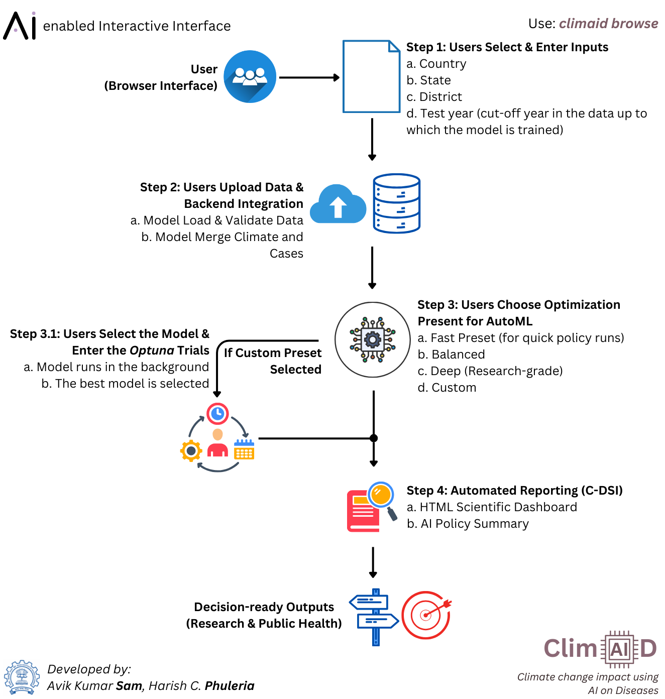
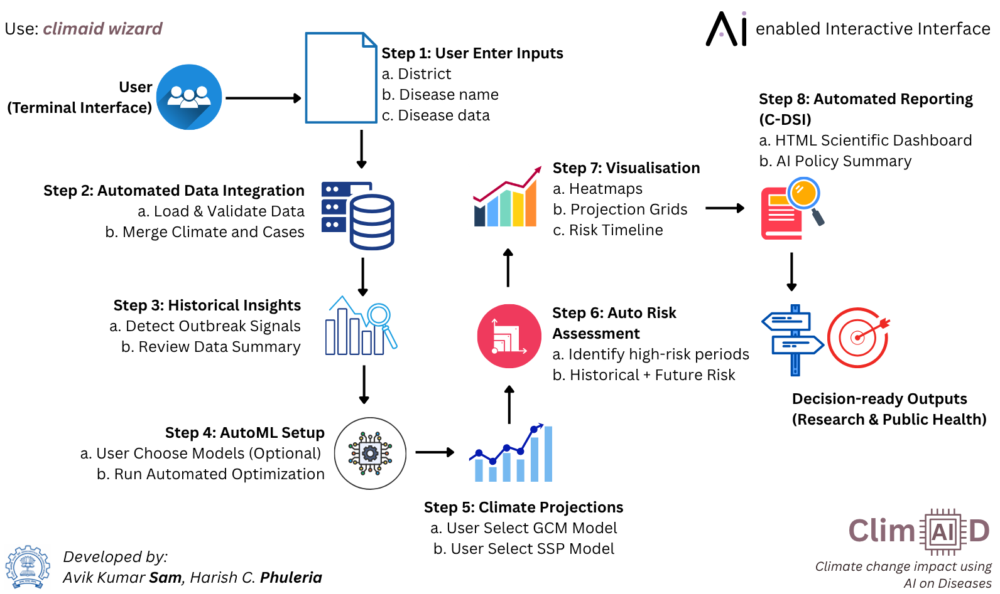

# ClimAID - **Climate change impact using AI on Diseases**

!!! warning "Under active testing — version 0.4.1 (beta)"
    ClimAID 0.4.1 is under active testing. Its methods have been checked on synthetic data with a known
    answer, but **not yet validated on real surveillance data or real CMIP6 projections**. Treat outputs as
    research estimates, check them against local knowledge, and do not use them as the sole basis for
    public-health decisions. See [Status & validation](guide/status.md) for what has and has not been tested.

ClimAID is an integrated toolkit for modelling, forecasting and projecting climate-sensitive diseases such as
dengue and malaria, using machine learning, a climate-informed transmission model and climate-model ensembles.

* ClimAID has built-in climate data for South Asian countries: India, Nepal, Bhutan, Sri Lanka, Myanmar,
  Afghanistan, Pakistan and Bangladesh.
* Data from other countries are supported through the global mode of the browser interface.

---

## Two pipelines

| | **ClimAID v2** (recommended) | **ClimAID v1** (legacy) |
|---|---|---|
| Purpose | Forecasts for the coming months, and climate-scenario outlooks to 2050–2100 | Lag-optimised point predictions and CMIP6 projections |
| Output | Expected cases **with likely ranges** | Expected cases |
| Models | 21, including a climate transmission model and v1's stacked model | Stacked base → residual → correction models |
| Checked by | Held-out months, rolling backtests ("hindcasts"), calibrated ranges | One test year |
| Report | Plain-language summary + technical details | C-DSI deterministic report |

---

## What you can do

* Analyse historical disease patterns and detect past outbreak signals
* Link cases to temperature, rainfall, humidity and El Niño (ENSO), including lagged and interaction effects
* **Forecast** the coming months with likely ranges that are calibrated against past performance
* Compare 22 models, all tuned automatically, against a simple "same as recent years" baseline
* **Project** how cases could change under CMIP6 climate scenarios, with uncertainty from climate models,
  statistics and model structure
* Generate reports written for non-specialists, with full technical details for specialists

---

## Installation

```bash
pip install climaid              # core
pip install "climaid[ml]"        # + XGBoost, LightGBM, CatBoost
pip install --upgrade climaid    # upgrading from 0.1.x: read the Changelog first
```

Python 3.10 or newer. Package on PyPI: [pypi.org/project/climaid](https://pypi.org/project/climaid/).

---

## Quick examples

=== "v2 forecast"

    ```python
    from climaid.climaid_model import DiseaseModel

    dm = DiseaseModel(district="IND_Pune_MAHARASHTRA", disease_file="dengue.xlsx", disease_name="Dengue")

    result = dm.forecast_v2(
        forecast_origin="2023-12-31",   # use data up to this date
        horizon=12,                      # months ahead
        tuning="balanced",               # fast | balanced | deep (tuning is always on)
        run_hindcasts=True,              # backtests used to calibrate the likely ranges
        save_report=True,
    )
    print(result["report_path"])
    ```

=== "v2 climate scenarios"

    ```python
    outlook = dm.project_v2(end_year=2050, ssps=["ssp245", "ssp585"])
    print(outlook["decades"])            # change per decade vs. the historical baseline
    print(outlook["report_path"])
    ```

=== "v1 (legacy)"

    ```python
    dm.optimize_lags()
    dm.train_final_model()
    ```

---

## Workflow

ClimAID has three interfaces.

* **ClimAID assistant** (South Asian data, or your own climate file)

    ```text
    climaid ai              # terminal
    climaid ai --browser    # chat page in your browser (also under "Assistant" in the dashboard)
    ```
    Describe what you want in plain words ("forecast dengue in Pune for the next 6 months"); the assistant asks
    for anything missing, runs ClimAID and explains the results. Built in and offline, with no AI model. See
    [ClimAID assistant](guide/assistant.md).

* **ClimAID Browser Interface** (South Asian and global countries)

    ```text
    climaid browse
    ```
    The dashboard has separate **v2** (default) and **v1** pages. Every setting has an ⓘ tip explaining it.

    

    Figure 1: Guide to the ClimAID Browser Interface (version 1). The version 2 has major changes, and the new figure will be updated in due course of time. 

* **ClimAID Wizard Interface** (South Asian countries)

    ```text
    climaid wizard
    ```
    The wizard asks which pipeline to run (v1, v2 or both) and only asks that pipeline's questions.

    

    Figure 2: Guide to the ClimAID Wizard Interface (version 1). The version 2 has major changes, and the new figure will be updated in due course of time. 

* **This documentation, offline**

    ```text
    climaid docs
    ```
    Opens the copy of this site that ships with your installation (also linked from the dashboard at
    `/documentation/`).

---

## Documentation

* **[Status & validation](guide/status.md)** — what has been tested, results, known limitations
* **[v2 forecasting](guide/v2_forecasting.md)** — models, tuning, backtests and calibrated ranges
* **[Climate scenario outlook](guide/scenarios.md)** — how projections are made and how to read them
* **[Reading the reports](guide/reports.md)** — the plain-language report and its trust rating
* **[Benchmarks & synthetic data](guide/benchmarks.md)** — how ClimAID is tested
* **[Changelog](changelog.md)** — what changed in each version, including changes that alter results
* API reference for all modules (sidebar)

---

## Designed for

* Epidemiologists
* Climate scientists
* Public health analysts
* Data scientists

---

## Development underway

* Validation on real surveillance data across multiple districts (**priority**)
* More models
    - Spatiotemporal ML models
    - Integrated SEIR-ML hybrid framework
* More user choices
    - Selection of covariates; user-supplied covariates
    - Selection of LLMs through the browser interface
* For technical feedback, please email: [avik.sam@iitb.ac.in](mailto:avik.sam@iitb.ac.in)

---

## Dependencies & License

### Dependencies

* Core requirements (installed automatically)

    ```text
    numpy  pandas  scipy  scikit-learn  joblib  optuna
    matplotlib  seaborn  plotly  markdown
    fastapi  uvicorn  python-multipart  pydantic  typer
    openpyxl  requests  pooch
    ```

* Optional gradient-boosting libraries (XGBoost, LightGBM, CatBoost)

    ```bash
    pip install "climaid[ml]"
    ```

* Optional local LLM reports

    Install [Ollama](https://ollama.com) and start it with `ollama serve`. ClimAID connects to it over HTTP;
    no extra Python package is needed. Without it, ClimAID uses its built-in deterministic C-DSI reports.

---

### License

Designed by **Avik Kumar Sam** & **Harish C. Phuleria** as open-access software.

* MIT License summary
    - Free to use, modify and distribute
    - Suitable for research and commercial use
    - No warranty is provided
    - Attribution is required

* Full licence text: [https://github.com/sam-as/ClimAID/blob/main/LICENSE](https://github.com/sam-as/ClimAID/blob/main/LICENSE)

We thank the [National Disease Modelling Consortium](https://www.ndmconsortium.com/) for their support. 
{ .partner-logo-home }
---
